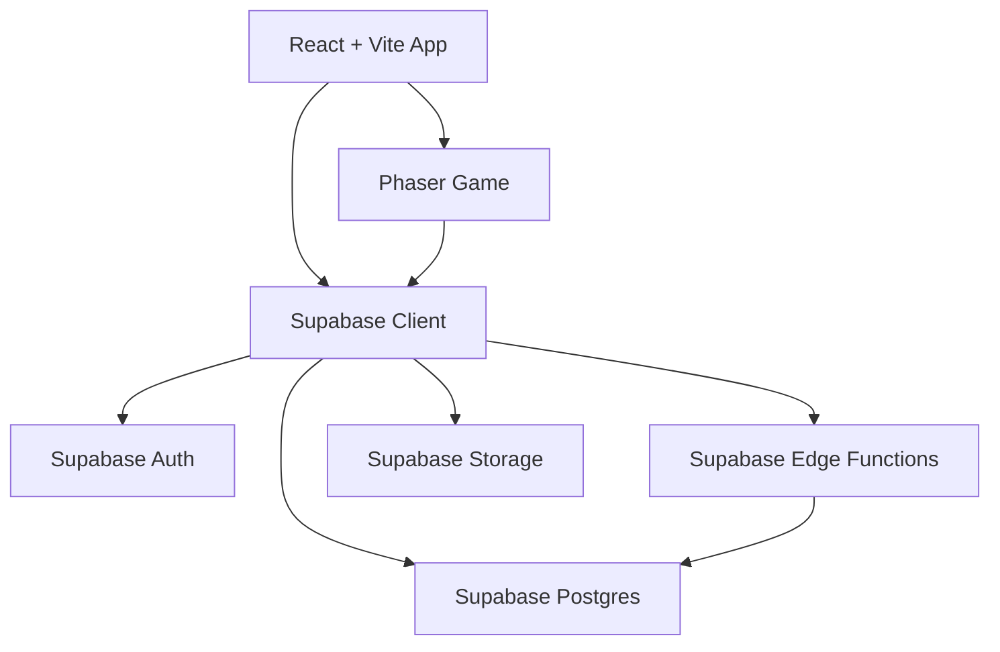

# Architecture Decision Record — Mini Game Platform

## ADR-001: Web-First Mini Game Platform with Supabase Cloud

**Status:** Accepted
**Date:** 2026-06-01

## Context

We want to build a fast, lightweight mini game platform with managed backend capability.

The platform needs:

* Anonymous login
* User profile
* Game catalog
* Coin balance
* Game session
* Score submission
* Basic leaderboard
* Share result
* Web-first release
* Android/iOS support later through hybrid wrapper

The MVP should avoid backend infrastructure complexity and should not require running a local database.

## Decision

Use this stack:

| Layer          | Decision                  |
| -------------- | ------------------------- |
| App Shell      | React + Vite + TypeScript |
| Game Engine    | Phaser                    |
| Backend        | Supabase Cloud            |
| Auth           | Supabase Auth             |
| Database       | Supabase Postgres         |
| Backend Logic  | Supabase Edge Functions   |
| Storage        | Supabase Storage          |
| Authorization  | Row Level Security        |
| Mobile Wrapper | Capacitor                 |

The app will connect directly to a hosted Supabase Cloud project.

We will **not run Supabase local DB for MVP**.

## Rationale

This stack is selected because:

1. **Fast MVP delivery** — Supabase provides managed auth, database, functions, and storage.
2. **Good data structure** — Postgres fits profile, game session, score, coin ledger, leaderboard, and post data.
3. **Web-first iteration** — React + Phaser is suitable for lightweight casual mini games.
4. **Backend logic stays trusted** — score submission, coin reward, and session validation run through Edge Functions.
5. **Mobile path remains open** — Capacitor can wrap the web app into Android/iOS later.
6. **Lower setup friction** — direct Supabase Cloud avoids Docker/local DB setup during MVP.

## Architecture



## Core Backend Modules

| Module          | Responsibility                                 |
| --------------- | ---------------------------------------------- |
| `profiles`      | User profile, display name, avatar, total coin |
| `games`         | Game catalog and game configuration            |
| `game_sessions` | Tracks each game play session                  |
| `scores`        | Stores submitted scores                        |
| `coin_ledger`   | Stores coin transactions                       |
| `posts`         | Stores share result metadata                   |

## Edge Functions

| Function             | Purpose                                     |
| -------------------- | ------------------------------------------- |
| `start_game_session` | Create session and nonce before game starts |
| `submit_score`       | Validate score, save result, grant coin     |
| `create_share_post`  | Create share result metadata                |

## Security Decision

Use Row Level Security on all public tables.

Rules:

* Client can read active games.
* Client can read/update own profile.
* Client can read own coin history.
* Client must not directly insert scores.
* Client must not directly update coin balance.
* Trusted writes must go through Edge Functions.
* Service role key must only exist in Supabase Edge Functions.

## Game Session Decision

Every game play must start with `start_game_session`.

Flow:

```text
Open game
→ authenticate user
→ start_game_session
→ play game
→ submit_score
→ validate score
→ save score
→ grant coin
→ show result
```

## Cloud Supabase Decision

For MVP, development will point directly to Supabase Cloud.

```text
Frontend local dev
→ Supabase Cloud Auth
→ Supabase Cloud Postgres
→ Supabase Cloud Edge Functions
→ Supabase Cloud Storage
```

Database schema changes must still be saved as migration files:

```text
supabase/migrations/
```

Manual changes in Supabase Studio are allowed only for exploration. Permanent changes must be converted into migration SQL.

## Mobile Decision

The app is web-first.

After MVP stabilizes, use Capacitor to wrap the same web app into:

* Android
* iOS

This is acceptable because the initial games are lightweight 2D casual games.

## Alternatives Considered

| Alternative       | Reason Not Selected                                             |
| ----------------- | --------------------------------------------------------------- |
| Firebase          | Less ideal for relational score, coin ledger, and session model |
| Flutter           | Slower for web-first mini game iteration                        |
| Unity             | Too heavy for lightweight casual mini games                     |
| Custom Backend    | Too much infrastructure for MVP                                 |
| Local Supabase DB | Adds setup friction; skipped for MVP speed                      |

## Consequences

Positive:

* Fast to build
* Minimal backend operations
* Clear relational data model
* Easy leaderboard and coin ledger queries
* Can become PWA and mobile app later

Trade-offs:

* Cloud DB changes need migration discipline
* Hybrid wrapper may not fit heavy games
* Anti-cheat is basic, not fully server-authoritative
* Complex AR/filter features may require native SDK later

## Final Decision

Build the MVP as a **web-first mini game platform** using:

```text
React + Vite + TypeScript
Phaser
Supabase Cloud
Capacitor later for Android/iOS
```

The MVP will connect directly to Supabase Cloud and will not use a local Supabase database.
