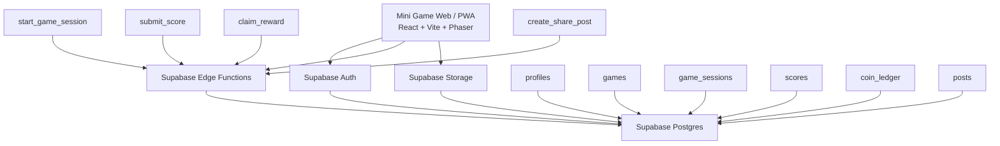
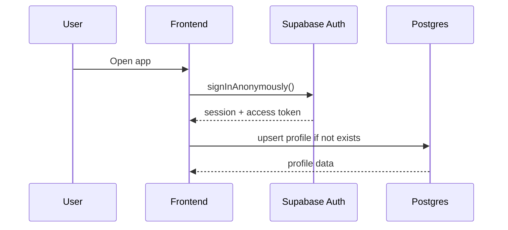
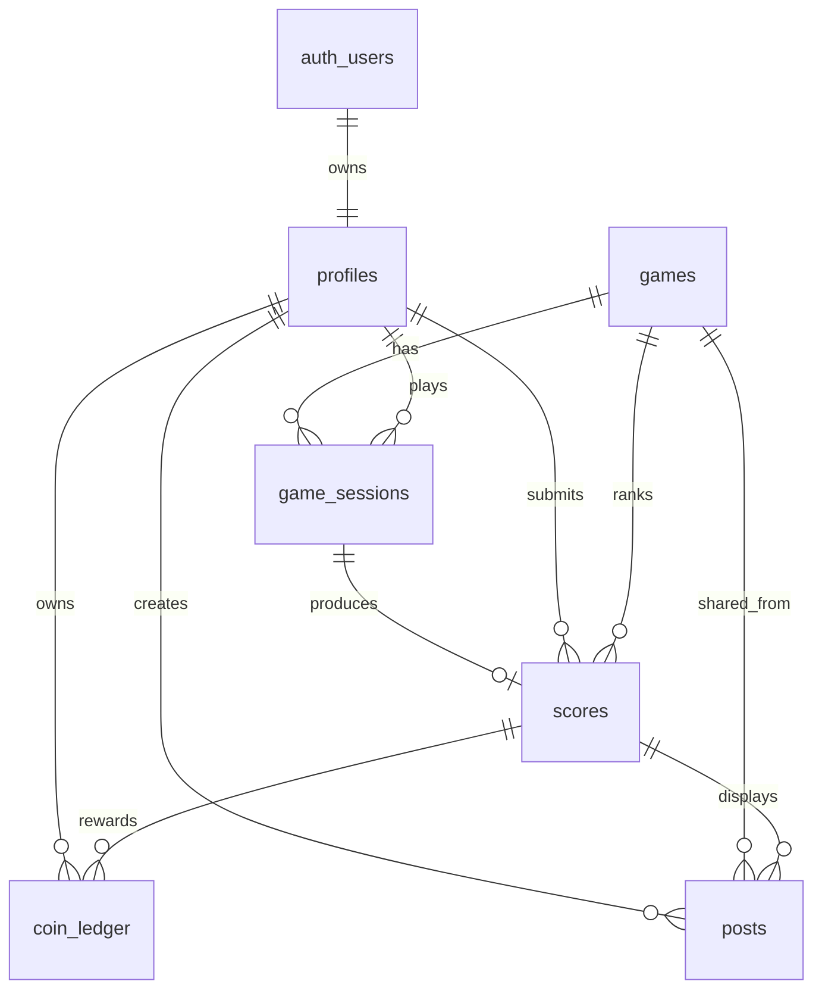

# Technical Solution Design — Supabase Mini Game Platform

## 1. Tujuan Dokumen

Dokumen ini menjelaskan desain teknis awal untuk backend platform mini game berbasis Supabase. Fokus MVP adalah menyediakan fondasi backend yang cepat dibuat, aman untuk score submission dasar, dan mudah dikembangkan untuk banyak mini game sederhana.

## 2. Scope MVP

### 2.1 In Scope

MVP backend mencakup kapabilitas berikut:

1. Authentication

   * Anonymous login untuk frictionless play.
   * Account linking ke email/social login pada fase berikutnya.
   * Setiap user memiliki `auth.users.id` sebagai identity utama.

2. Profile

   * Profile publik sederhana.
   * Display name.
   * Avatar URL.
   * Total coin.
   * Total play count.

3. Game Catalog / List Game

   * List game aktif.
   * Detail game berdasarkan slug.
   * Konfigurasi game berbasis JSON.
   * Status game: draft, active, inactive, archived.

4. Coin / Reward

   * Coin balance per user.
   * Ledger transaksi coin agar audit jelas.
   * Reward coin dari game session valid.
   * Tidak ada payment engine pada MVP.

5. Game Session

   * Start game session dari backend.
   * Generate session ID dan nonce.
   * Submit score melalui Edge Function.
   * Validasi dasar terhadap durasi, max score, dan duplicate submission.
   * Simpan score valid/suspicious/rejected.

6. Leaderboard Dasar

   * Query top score per game.
   * Daily/weekly/all-time dapat ditambahkan setelah MVP.

7. Share Result / Post Dasar

   * Simpan metadata post/share result.
   * Media asset dapat disimpan di Supabase Storage.

### 2.2 Out of Scope MVP

1. Payment engine.
2. In-app purchase.
3. Certified anti-cheat.
4. Server-authoritative realtime multiplayer.
5. Advanced game economy.
6. Admin CMS lengkap.
7. Moderation content otomatis.
8. TikTok/Instagram direct API posting.
9. Push notification.
10. Complex achievement system.

## 3. Teknologi yang Digunakan

| Area             | Teknologi                                             |
| ---------------- | ----------------------------------------------------- |
| Frontend         | React + Vite                                          |
| Game Engine      | Phaser                                                |
| Backend Managed  | Supabase                                              |
| Authentication   | Supabase Auth                                         |
| Database         | Supabase Postgres                                     |
| Backend Logic    | Supabase Edge Functions                               |
| Authorization    | Row Level Security                                    |
| Storage          | Supabase Storage                                      |
| Hosting Frontend | Vercel / Netlify / Supabase-compatible static hosting |

## 4. High Level Architecture



## 5. Prinsip Desain

1. Supabase Auth menjadi source of truth untuk user identity.
2. Tabel `profiles` hanya menyimpan data aplikasi, bukan credential.
3. Client tidak boleh insert score langsung ke tabel `scores`.
4. Score submission wajib melalui Edge Function `submit_score`.
5. Coin tidak boleh diupdate langsung oleh client.
6. Perubahan coin wajib melalui `coin_ledger`.
7. Row Level Security wajib aktif untuk semua tabel user-facing.
8. Data katalog game aktif boleh dibaca public/authenticated.
9. Konfigurasi validasi game disimpan di tabel `games.config`.
10. Logic anti-cheat MVP bersifat heuristic, bukan definitive.

## 6. Authentication Design

### 6.1 Auth Strategy

MVP menggunakan anonymous login agar user dapat langsung bermain tanpa registrasi.

Flow:



### 6.2 Account Upgrade Strategy

Pada fase berikutnya, anonymous user dapat di-link ke email, Google, atau Apple login agar progress tidak hilang.

Status user:

| Status     | Penjelasan                            |
| ---------- | ------------------------------------- |
| anonymous  | User belum attach email/social login  |
| registered | User sudah link ke email/social login |
| blocked    | User diblokir dari aktivitas tertentu |

## 7. Database Design

### 7.1 Entity Relationship Overview



Note: `auth_users` merepresentasikan `auth.users` bawaan Supabase.

## 8. SQL Schema Draft

### 8.1 Enum Types

```sql
create type game_status as enum ('draft', 'active', 'inactive', 'archived');
create type session_status as enum ('started', 'submitted', 'expired', 'rejected');
create type score_validation_status as enum ('valid', 'suspicious', 'rejected');
create type coin_transaction_type as enum ('reward', 'adjustment', 'spend', 'refund');
create type user_app_status as enum ('anonymous', 'registered', 'blocked');
```

### 8.2 Profiles

```sql
create table public.profiles (
  id uuid primary key references auth.users(id) on delete cascade,
  username text unique,
  display_name text,
  avatar_url text,
  app_status user_app_status not null default 'anonymous',
  total_coin int not null default 0 check (total_coin >= 0),
  total_play_count int not null default 0 check (total_play_count >= 0),
  created_at timestamptz not null default now(),
  updated_at timestamptz not null default now()
);
```

### 8.3 Games

```sql
create table public.games (
  id uuid primary key default gen_random_uuid(),
  slug text unique not null,
  title text not null,
  description text,
  thumbnail_url text,
  status game_status not null default 'draft',
  version int not null default 1,
  config jsonb not null default '{}',
  created_at timestamptz not null default now(),
  updated_at timestamptz not null default now()
);
```

Contoh `games.config`:

```json
{
  "timeLimitMs": 30000,
  "maxScore": 1000,
  "maxScorePerSecond": 50,
  "rewardCoin": 5,
  "leaderboardEnabled": true,
  "shareEnabled": true
}
```

### 8.4 Game Sessions

```sql
create table public.game_sessions (
  id uuid primary key default gen_random_uuid(),
  user_id uuid not null references auth.users(id) on delete cascade,
  game_id uuid not null references public.games(id),
  game_version int not null,
  nonce text not null,
  status session_status not null default 'started',
  started_at timestamptz not null default now(),
  ended_at timestamptz,
  submitted_score int,
  duration_ms int,
  client_meta jsonb not null default '{}',
  created_at timestamptz not null default now()
);

create index idx_game_sessions_user_id on public.game_sessions(user_id);
create index idx_game_sessions_game_id on public.game_sessions(game_id);
create index idx_game_sessions_status on public.game_sessions(status);
```

### 8.5 Scores

```sql
create table public.scores (
  id uuid primary key default gen_random_uuid(),
  user_id uuid not null references auth.users(id) on delete cascade,
  game_id uuid not null references public.games(id),
  session_id uuid not null unique references public.game_sessions(id),
  score int not null check (score >= 0),
  duration_ms int not null check (duration_ms >= 0),
  validation_status score_validation_status not null default 'valid',
  validation_reason text,
  created_at timestamptz not null default now()
);

create index idx_scores_game_score on public.scores(game_id, score desc);
create index idx_scores_user_id on public.scores(user_id);
create index idx_scores_created_at on public.scores(created_at desc);
```

### 8.6 Coin Ledger

```sql
create table public.coin_ledger (
  id uuid primary key default gen_random_uuid(),
  user_id uuid not null references auth.users(id) on delete cascade,
  score_id uuid references public.scores(id),
  transaction_type coin_transaction_type not null,
  amount int not null,
  balance_after int not null check (balance_after >= 0),
  reason text,
  metadata jsonb not null default '{}',
  created_at timestamptz not null default now()
);

create index idx_coin_ledger_user_id on public.coin_ledger(user_id);
create index idx_coin_ledger_created_at on public.coin_ledger(created_at desc);
```

### 8.7 Posts / Share Result

```sql
create table public.posts (
  id uuid primary key default gen_random_uuid(),
  user_id uuid not null references auth.users(id) on delete cascade,
  game_id uuid not null references public.games(id),
  score_id uuid references public.scores(id),
  caption text,
  media_url text,
  share_slug text unique not null,
  is_public boolean not null default true,
  created_at timestamptz not null default now()
);

create index idx_posts_user_id on public.posts(user_id);
create index idx_posts_game_id on public.posts(game_id);
create index idx_posts_share_slug on public.posts(share_slug);
```

## 9. Row Level Security Design

### 9.1 Enable RLS

```sql
alter table public.profiles enable row level security;
alter table public.games enable row level security;
alter table public.game_sessions enable row level security;
alter table public.scores enable row level security;
alter table public.coin_ledger enable row level security;
alter table public.posts enable row level security;
```

### 9.2 Profiles Policies

```sql
create policy "profiles_select_public"
on public.profiles
for select
to authenticated
using (true);

create policy "profiles_update_own"
on public.profiles
for update
to authenticated
using (auth.uid() = id)
with check (auth.uid() = id);

create policy "profiles_insert_own"
on public.profiles
for insert
to authenticated
with check (auth.uid() = id);
```

### 9.3 Games Policies

```sql
create policy "games_select_active"
on public.games
for select
to authenticated
using (status = 'active');
```

Admin insert/update game sebaiknya dilakukan via service role/admin panel terpisah, bukan dari client biasa.

### 9.4 Game Sessions Policies

Client boleh membaca session miliknya sendiri. Insert/update session dilakukan lewat Edge Function.

```sql
create policy "game_sessions_select_own"
on public.game_sessions
for select
to authenticated
using (auth.uid() = user_id);
```

### 9.5 Scores Policies

```sql
create policy "scores_select_valid"
on public.scores
for select
to authenticated
using (validation_status in ('valid', 'suspicious'));
```

Insert score dilakukan via Edge Function service role.

### 9.6 Coin Ledger Policies

```sql
create policy "coin_ledger_select_own"
on public.coin_ledger
for select
to authenticated
using (auth.uid() = user_id);
```

Insert coin ledger dilakukan via Edge Function service role.

### 9.7 Posts Policies

```sql
create policy "posts_select_public"
on public.posts
for select
to authenticated
using (is_public = true or auth.uid() = user_id);

create policy "posts_select_own"
on public.posts
for select
to authenticated
using (auth.uid() = user_id);
```

Create post dapat dilakukan via Edge Function agar share_slug dan ownership divalidasi.

## 10. Edge Functions Design

### 10.1 Function List

| Function              | Tujuan                                                           |
| --------------------- | ---------------------------------------------------------------- |
| `start_game_session`  | Membuat session baru sebelum user mulai main                     |
| `submit_score`        | Submit dan validasi score                                        |
| `create_share_post`   | Membuat metadata post/share result                               |
| `claim_reward`        | Optional, jika reward tidak langsung diberikan saat submit score |
| `get_profile_summary` | Optional, membaca profile + coin + stat agregat                  |

## 11. API Contract

### 11.1 Start Game Session

Endpoint:

```text
POST /functions/v1/start_game_session
```

Request:

```json
{
  "gameSlug": "reaction-time",
  "clientMeta": {
    "platform": "web",
    "appVersion": "0.1.0",
    "userAgent": "browser"
  }
}
```

Process:

1. Validate JWT user.
2. Find active game by slug.
3. Create nonce.
4. Create game session.
5. Return session data.

Response:

```json
{
  "sessionId": "uuid",
  "gameId": "uuid",
  "gameVersion": 1,
  "nonce": "random-string",
  "startedAt": "2026-06-01T12:00:00Z",
  "config": {
    "timeLimitMs": 30000,
    "maxScore": 1000,
    "maxScorePerSecond": 50,
    "rewardCoin": 5
  }
}
```

Error Response:

```json
{
  "error": "GAME_NOT_FOUND_OR_INACTIVE"
}
```

### 11.2 Submit Score

Endpoint:

```text
POST /functions/v1/submit_score
```

Request:

```json
{
  "sessionId": "uuid",
  "score": 450,
  "durationMs": 28000,
  "checksum": "optional-client-checksum"
}
```

Process:

1. Validate JWT user.
2. Find session by `sessionId` and `user_id`.
3. Reject if session already submitted.
4. Load game config.
5. Validate duration.
6. Validate max score.
7. Validate max score per second.
8. Determine validation status.
9. Insert score.
10. Update session status.
11. Increment profile total play count.
12. Add coin reward if valid.
13. Return result.

Response:

```json
{
  "scoreId": "uuid",
  "validationStatus": "valid",
  "coinReward": 5,
  "totalCoin": 105,
  "rankHint": 12
}
```

Possible validation status:

| Status     | Meaning                                                  |
| ---------- | -------------------------------------------------------- |
| valid      | Score diterima normal                                    |
| suspicious | Score disimpan tapi tidak masuk reward/leaderboard utama |
| rejected   | Score ditolak                                            |

### 11.3 List Games

Untuk MVP, list games dapat dibaca langsung dari client memakai Supabase client karena hanya game `active` yang terlihat oleh RLS.

Query:

```ts
const { data, error } = await supabase
  .from('games')
  .select('id, slug, title, description, thumbnail_url, version, config')
  .eq('status', 'active')
  .order('created_at', { ascending: false })
```

Response shape:

```json
[
  {
    "id": "uuid",
    "slug": "reaction-time",
    "title": "Reaction Time",
    "description": "Tap as fast as possible",
    "thumbnail_url": "https://...",
    "version": 1,
    "config": {
      "timeLimitMs": 30000
    }
  }
]
```

### 11.4 Get / Upsert Profile

Client dapat membaca dan mengupdate profile miliknya sendiri.

Upsert saat pertama login:

```ts
const user = (await supabase.auth.getUser()).data.user

await supabase.from('profiles').upsert({
  id: user.id,
  display_name: 'Guest',
  app_status: user.is_anonymous ? 'anonymous' : 'registered'
})
```

Get profile:

```ts
const { data, error } = await supabase
  .from('profiles')
  .select('id, username, display_name, avatar_url, total_coin, total_play_count, app_status')
  .eq('id', user.id)
  .single()
```

### 11.5 Create Share Post

Endpoint:

```text
POST /functions/v1/create_share_post
```

Request:

```json
{
  "scoreId": "uuid",
  "caption": "Beat my score!",
  "mediaUrl": "https://storage-url/result.png"
}
```

Process:

1. Validate JWT user.
2. Validate score belongs to user.
3. Validate score is valid/suspicious.
4. Generate unique `shareSlug`.
5. Insert post.
6. Return share URL.

Response:

```json
{
  "postId": "uuid",
  "shareSlug": "abc123",
  "shareUrl": "https://app-domain.com/share/abc123"
}
```

## 12. Coin Design

### 12.1 Coin Rules MVP

1. Coin hanya diberikan untuk score `valid`.
2. Score `suspicious` tidak mendapat coin secara default.
3. Score `rejected` tidak disimpan sebagai reward.
4. Setiap `session_id` hanya boleh menghasilkan satu reward.
5. Semua perubahan coin harus tercatat di `coin_ledger`.

### 12.2 Reward Calculation

Sumber reward:

```text
games.config.rewardCoin
```

Contoh:

```json
{
  "rewardCoin": 5
}
```

Jika game config tidak memiliki reward, default reward adalah 0.

## 13. Leaderboard Design

### 13.1 MVP Query

MVP leaderboard dapat langsung query dari tabel `scores`:

```sql
select
  s.user_id,
  p.display_name,
  p.avatar_url,
  s.score,
  s.created_at
from public.scores s
join public.profiles p on p.id = s.user_id
where s.game_id = :game_id
  and s.validation_status = 'valid'
order by s.score desc, s.created_at asc
limit 100;
```

### 13.2 Future Optimization

Jika traffic sudah tinggi, buat tabel/materialized view:

```text
leaderboard_daily
leaderboard_weekly
leaderboard_all_time
```

## 14. Storage Design

### 14.1 Bucket

| Bucket          | Access                                | Isi                          |
| --------------- | ------------------------------------- | ---------------------------- |
| `game-assets`   | Public read, admin write              | thumbnail, static asset game |
| `share-results` | Public read, owner write via function | generated image/video result |
| `avatars`       | Public read, owner write              | avatar user                  |

### 14.2 Path Convention

```text
game-assets/{game_slug}/thumbnail.png
share-results/{user_id}/{post_id}.png
avatars/{user_id}/avatar.png
```

## 15. Security Design

### 15.1 Main Security Rules

1. Enable RLS on all public tables.
2. Do not expose service role key to frontend.
3. Client may read allowed data only.
4. Client may update own profile only.
5. Client may not directly update coin.
6. Client may not directly insert score.
7. Edge Functions validate JWT and ownership.
8. Edge Functions use service role only for controlled writes.
9. Storage write should be restricted by owner/function.
10. Suspicious score should not receive reward.

### 15.2 Anti-Cheat MVP

Validation rules:

| Rule              | Description                                                  |
| ----------------- | ------------------------------------------------------------ |
| Session ownership | Session harus milik user yang submit                         |
| Single submission | Satu session hanya boleh submit sekali                       |
| Duration min/max  | Durasi tidak boleh terlalu cepat/terlalu lama                |
| Max score         | Score tidak boleh melewati `config.maxScore`                 |
| Score velocity    | `score / duration` tidak boleh melewati `maxScorePerSecond`  |
| Game version      | Session harus memakai game version aktif saat session dibuat |

## 16. Frontend Integration Example

### 16.1 Supabase Client Setup

```ts
import { createClient } from '@supabase/supabase-js'

export const supabase = createClient(
  import.meta.env.VITE_SUPABASE_URL,
  import.meta.env.VITE_SUPABASE_ANON_KEY
)
```

### 16.2 Anonymous Login

```ts
const { data, error } = await supabase.auth.signInAnonymously()

if (error) {
  throw error
}
```

### 16.3 Start Game Session

```ts
const { data, error } = await supabase.functions.invoke('start_game_session', {
  body: {
    gameSlug: 'reaction-time',
    clientMeta: {
      platform: 'web',
      appVersion: '0.1.0'
    }
  }
})
```

### 16.4 Submit Score

```ts
const { data, error } = await supabase.functions.invoke('submit_score', {
  body: {
    sessionId,
    score,
    durationMs
  }
})
```

## 17. Edge Function Pseudocode

### 17.1 start_game_session

```ts
serve(async (req) => {
  const user = await getAuthenticatedUser(req)
  const { gameSlug, clientMeta } = await req.json()

  const game = await findActiveGameBySlug(gameSlug)
  if (!game) return error('GAME_NOT_FOUND_OR_INACTIVE', 404)

  const nonce = crypto.randomUUID()

  const session = await insertGameSession({
    userId: user.id,
    gameId: game.id,
    gameVersion: game.version,
    nonce,
    clientMeta
  })

  return json({
    sessionId: session.id,
    gameId: game.id,
    gameVersion: game.version,
    nonce,
    startedAt: session.started_at,
    config: game.config
  })
})
```

### 17.2 submit_score

```ts
serve(async (req) => {
  const user = await getAuthenticatedUser(req)
  const { sessionId, score, durationMs } = await req.json()

  const session = await findSessionForUser(sessionId, user.id)
  if (!session) return error('SESSION_NOT_FOUND', 404)
  if (session.status !== 'started') return error('SESSION_ALREADY_SUBMITTED', 409)

  const game = await findGameById(session.game_id)
  const validation = validateScore({ score, durationMs, gameConfig: game.config })

  if (validation.status === 'rejected') {
    await markSessionRejected(sessionId, score, durationMs)
    return error('SCORE_REJECTED', 400, validation.reason)
  }

  const scoreRecord = await insertScore({
    userId: user.id,
    gameId: game.id,
    sessionId,
    score,
    durationMs,
    validationStatus: validation.status,
    validationReason: validation.reason
  })

  await markSessionSubmitted(sessionId, score, durationMs)
  await incrementTotalPlayCount(user.id)

  let coinReward = 0
  let totalCoin = null

  if (validation.status === 'valid') {
    coinReward = game.config.rewardCoin ?? 0
    totalCoin = await grantCoinReward(user.id, scoreRecord.id, coinReward)
  }

  return json({
    scoreId: scoreRecord.id,
    validationStatus: validation.status,
    coinReward,
    totalCoin
  })
})
```

## 18. Development Setup

### 18.1 Project Structure

```text
minigame-platform/
  apps/
    web/
      src/
        games/
        features/
          auth/
          profile/
          game-catalog/
          game-session/
          leaderboard/
        lib/
          supabase.ts
  supabase/
    migrations/
    functions/
      start_game_session/
        index.ts
      submit_score/
        index.ts
      create_share_post/
        index.ts
```

### 18.2 Environment Variables

Frontend:

```text
VITE_SUPABASE_URL=
VITE_SUPABASE_ANON_KEY=
```

Edge Functions:

```text
SUPABASE_URL=
SUPABASE_ANON_KEY=
SUPABASE_SERVICE_ROLE_KEY=
```

Important: `SUPABASE_SERVICE_ROLE_KEY` hanya boleh ada di server/function environment.

## 19. MVP Delivery Plan

Status legend:

- [x] Done (sudah ada implementasi di repo)
- [ ] Pending
- [ ] In progress (ditandai dengan catatan)

Progress snapshot per 2 Juni 2026 (berdasarkan kondisi codebase saat ini).

### Phase 0 — Supabase Foundation

- [x] Create Supabase project.
- [ ] Enable anonymous sign-in. (in progress: local config sudah enable, hosted project setting masih manual)
- [x] Create database schema.
- [x] Enable RLS.
- [x] Create initial policies.
- [x] Seed first game.

### Phase 1 — Auth + Profile

- [x] Frontend anonymous login.
- [x] Auto create/upsert profile.
- [x] Display profile summary.
- [x] Edit display name.

### Phase 2 — Game Catalog

- [x] List active games.
- [x] Open game detail.
- [x] Read game config.

### Phase 3 — Game Session

- [x] Create `start_game_session` Edge Function.
- [x] Integrate frontend start session.
- [x] Store session ID in game runtime state.

### Phase 4 — Score + Coin

- [x] Create `submit_score` Edge Function.
- [x] Validate score.
- [x] Insert score.
- [x] Update coin ledger.
- [x] Update total coin.
- [x] Show result page.

### Phase 5 — Leaderboard + Share

- [x] Query top scores.
- [x] Create share post metadata.
- [x] Generate share page.

## 20. Initial Seed Data

```sql
insert into public.games (
  slug,
  title,
  description,
  status,
  version,
  config
) values (
  'reaction-time',
  'Reaction Time',
  'Tap as fast as possible when the signal appears.',
  'active',
  1,
  '{
    "timeLimitMs": 30000,
    "maxScore": 1000,
    "maxScorePerSecond": 50,
    "rewardCoin": 5,
    "leaderboardEnabled": true,
    "shareEnabled": true
  }'::jsonb
);
```

## 21. Open Questions

1. Apakah MVP akan menggunakan anonymous-only dulu, atau langsung tambah Google login?
2. Apakah coin hanya reward internal, atau nanti bisa dibelanjakan?
3. Apakah leaderboard cukup per game all-time dulu?
4. Apakah mini game pertama adalah reaction-time, tap game, memory card, atau filter-style camera game?
5. Apakah share result cukup berupa URL page dulu, atau perlu generated image?

## 22. Recommended MVP Decision

Untuk kecepatan, keputusan awal yang disarankan:

1. Auth: anonymous login dulu.
2. Leaderboard: all-time per game dulu.
3. Coin: reward-only, belum spend.
4. Share: URL result page dulu, generated image fase berikutnya.
5. Score validation: Edge Function heuristic validation.
